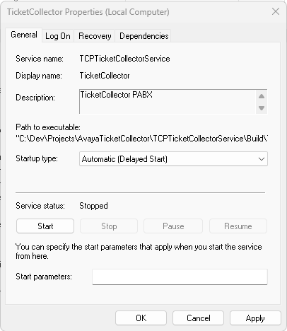

# Descrição

O TicketCollector é um serviço do windows que abre uma porta TCP e a cada x segundos checa se há alguma informação a ser lida nessa porta.

# Requisitos

- Windows Server 2016 ou superior
- .NET Framework 4.8
- PowerShell 5.1 ou superior
- IP fixo para o servidor em uma vLAN que tenha comunicação direta com a central
- Porta 51342 liberada para o protocolo TCP entre a central e o servidor na rede e no Firewall do servidor.

# Instalação

1. Copie os arquivos ".\Compilado\TicketCollector.zip" e ".\Resursos\InstallService.ps1" para o servidor de destino.
2. Execute o script "InstallService.ps1" como administrador.
3. Abra o "executar" do Windows (Win + R), digite "services.msc" e tecle enter.
4. Procure pelo serviço "TicketCollector", abra as propriedades, altere o tipo de inicialização para "Automático (Início atrasado)" - "Automatic (Delayed Start)" - e confirme.



# Configuração

## Configuração do Serviço

1. Altere no arquivo "C:\TicketCollector\TCPTicketCollectorService.exe.config", adicione o IP do servidor (onde está "<<IP_SERVER>>") em que o serviço está instalado.

```xml
<appSettings>
	<add key="IPAddress" value="<<IP_SERVER>>"/>
	<add key="Port" value="51342"/>
</appSettings>
```

2. Altere no arquivo "C:\TicketCollector\.TCPTicketCollectorServiceLog.config", o local de destino dos tickets recebidos da central.

```
<appender name="TicketLogAppender" type="log4net.Appender.RollingFileAppender">
	<file type="log4net.Util.PatternString" value="pasta_de_destino\Ticket_.csv" />
```

> **Importante!**
> Altere somente o texto "pasta_de_destino". O nome do arquivo, nessa string, deve ser Ticket_.csv.
>
> Isso é necessário porque logo após o underline o programa adiciona a data do ticket. E a extensão deve ser .csv para que o arquivo abra diretamente no excel.

## Configuração da Central

1. Acesse a central da qual deseja coletar os bilhetes
2. Vá em Sistema > nome_da_central > SMDR
3. Mude a Saída para "SMDR apenas" e faça as seguintes alterações:
   - adicione o IP do servidor onde está instalado o serviço
   - mude a porta para 51342
   - altere o "Registros para buffer" para 3000

     
4. Salve e aplique a configuração (não solicita reboot da central)

# Validação

Para validar o correto funcionamento da aplicação, é interessante realizar algumas ligações de teste e monitorar na central e no arquivo de logs do TicketCollector se a comunicação está ocorrendo da forma esperada.

## Monitorando a central

1. Abra o Monitor, vá em "Filters > Trace options"
2. Desabilite todas as opções clicando em "Clear All" e marque somente o "Call Detail Records".


O tipo de mensagem que vai aparecer no monitor será como mostrado abaixo. Elas mostram quando a central está se conectando a um destino TCP ("connected to...") e quando encerra a comunicação ("Client Destroyed").


Quando a central conseguir se conectar ao servidor para o envio do SMDR ela vai tentar enviar o bilhete e essa informação estará clara no Monitor.

[Adicionar print da mensagem de tentativa de envio do bilhete]

## Monitorando o TicketCollector

Para a monitoração do TicketCollector basta abrir o log em curso no Notepad++ e clicar no botão "Monitoring" que o documento atualizará automaticamente ao receber nova escrita.


O log está bem descrito, mas qualquer dúvida, basta abrir um chamado para adição da reposta da dúvida à documentação.
